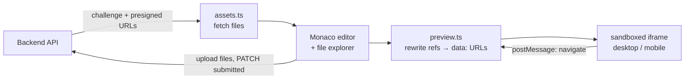

# Tsundre Ride — Frontend

**Problem:** Taking part in a frontend challenge usually means cloning a repo, setting up a local server and sending code back by hand.
**Solution:** A browser IDE. Open a challenge link, write HTML/CSS/JS in Monaco, see a live multi‑page preview on desktop or mobile, and submit. No install and no sign‑up. All data lives in the [backend](../backend) API.

## What's specific to this project

- **Accounts without sign‑up.** On first visit the browser generates a UUID, stores it in `localStorage`, and sends it as `X-Anonymous-ID` on every request ([src/api/client.ts](src/api/client.ts)). Ownership checks (edit buttons, "your submission") are worked out from that UUID ([src/utils/ownership.ts](src/utils/ownership.ts)).
- **Multi‑file preview without a server.** [src/utils/preview.ts](src/utils/preview.ts) rewrites every `src`, `href`, CSS `url()` and `@import` in the project files into `data:` URLs, so the iframe runs a full multi‑file project. Clicking an internal `<a href="about.html">` link opens that page inside the preview.
- **Files from presigned URLs.** Challenge and submission files are fetched straight from MinIO/S3 using the backend's `download_url`, then loaded into the editor ([src/utils/assets.ts](src/utils/assets.ts)).
- **ZIP export.** The project can be downloaded as a `.zip`, built entirely in the browser with `fflate` ([src/utils/download.ts](src/utils/download.ts)).
- **Timed challenges.** A countdown based on each challenge's `duration` ([src/components/ChallengeTimer.tsx](src/components/ChallengeTimer.tsx)).



## Routes

| Path | Page |
|---|---|
| `/` | Home |
| `/challenges` | Browse and search challenges |
| `/challenges/:slug` | Challenge details and submissions |
| `/challenges/:slug/solve` | Workspace for solving a challenge |
| `/challenges/:slug/submissions/:submissionSlug` | View one submission |
| `/create` | Create a challenge |
| `/code` | Free coding playground |

## Run

Start the [backend](../backend/README.md#running-locally) first, then:

```bash
npm install
npm run dev        # http://localhost:5173/tsundre-ride/
```

To use a backend other than `http://localhost:8000/api/v1`, set it in `frontend/.env`:

```
VITE_API_BASE_URL=https://your-api.example.com/api/v1
```

| Script | What it does |
|---|---|
| `npm run build` | Type-check and build to `dist/` |
| `npm run lint` | ESLint |
| `npm run deploy` | Build and publish `dist/` to GitHub Pages (base path `/tsundre-ride/`) |

**Stack:** React 19, TypeScript, Vite, Tailwind CSS v4, React Router, Monaco Editor, fflate.
